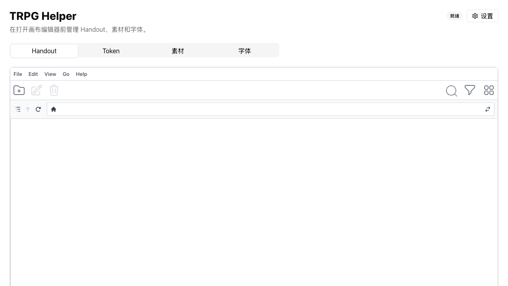

# TRPG Helper

TRPG Helper is a local-first desktop application for creating printable handouts, editing layered compositions, generating character tokens, and managing reusable image/font assets. It is built with Tauri 2, Rust, Vue 3, Konva, and PixiJS.

> The GitHub Release packages provided by this project are currently **not commercially code-signed or notarized**.



## Features

- Layer-based handout editor with images, text, shapes, polygons, paint layers, masks, transforms, effects, snapping, and multi-selection.
- Batch token projects with built-in/custom rings, custom backgrounds, split-ring composition, per-item styles, and PNG/JPEG/WebP/JXL export.
- Asset and font library with folders, tags, thumbnails, search, drag-and-drop, and project-safe source fallbacks.
- Optional foreground segmentation using BiRefNet General, U²-Net, BEN2, or macOS Vision.
- Local project storage. No account, telemetry service, cloud project database, or paid publishing service is required.
- Simplified Chinese and English user interfaces.

## Supported Releases

Version 1.0 supports only:

| Platform | Architecture | Package |
| --- | --- | --- |
| macOS | Apple Silicon (`aarch64`) | DMG |
| Windows | x86_64 | NSIS installer |
| Linux | x86_64 | AppImage |

Intel Mac, Windows ARM64, and Linux ARM64 are not currently supported. Releases are distributed only through [GitHub Releases](https://github.com/lowerbound123/trpg-helper/releases).

## Installation

### macOS Apple Silicon

Download the `.dmg`, mount it, and copy TRPG Helper to Applications. The package is not notarized, so macOS may block the first launch. Open **System Settings > Privacy & Security**, verify that the blocked application is TRPG Helper, and choose **Open Anyway**. Do not disable Gatekeeper globally.

### Windows x86_64

Run the NSIS setup executable. Microsoft Defender SmartScreen may show an unrecognized publisher warning because the installer is unsigned. Verify that the download comes from this repository's GitHub Releases page before choosing **More info > Run anyway**.

### Linux x86_64

Download the AppImage and make it executable:

```bash
chmod +x TRPG-Helper_1.0.0_linux_x86_64.AppImage
./TRPG-Helper_1.0.0_linux_x86_64.AppImage
```

The host distribution must provide a compatible WebKitGTK runtime. Ubuntu 22.04 or newer is the primary Linux build environment.

## Foreground Segmentation Models

Model weights are not stored in this Git repository or bundled into release packages. When foreground segmentation is first used, TRPG Helper downloads the selected model from its pinned HTTPS source, verifies its SHA-256 digest, and stores it in the local model cache.

| Model | Runtime source | Declared license |
| --- | --- | --- |
| BiRefNet General | ZhengPeng7/BiRefNet; ONNX distribution used by rembg | MIT |
| U²-Net | xuebinqin/U-2-Net; Heliosoph/u2net-onnx | Apache-2.0 |
| BEN2 Base | PramaLLC/BEN2 | MIT |
| macOS Vision | Apple system framework | Governed by the macOS license |

See [THIRD_PARTY_NOTICES.md](THIRD_PARTY_NOTICES.md) for source links and dependency notices. Availability of a download does not replace the upstream license terms; review them before redistribution or commercial use.

## Data Locations

The desktop application creates and uses:

```text
~/Documents/trpg-helper/
├── configuration.toml
├── data/
│   ├── library/
│   │   ├── assets/
│   │   ├── backgrounds/
│   │   ├── fonts/
│   │   ├── thumbnails/
│   │   └── index.json
│   ├── projects/
│   └── token-projects/
├── logs/
└── models/
    └── foreground-segmentation/
```

Temporary export staging uses the operating system's Tauri application-local data directory and is removed after a successful write. The logical `token-tmp` import folder is stored under the managed asset library. Paths with non-ASCII user names are supported through native `PathBuf` handling.

Back up `~/Documents/trpg-helper` before removing the application or making major configuration changes. Uninstalling the application does not intentionally delete this directory.

TRPG Helper does not upload telemetry. Local diagnostic logs can include project names and filesystem paths; review and redact them before attaching logs to a public issue.

## Development

Prerequisites:

- Node.js 22 or current LTS
- pnpm 11.8.0
- Rust stable (minimum 1.85)
- Tauri 2 system dependencies for your platform

Install dependencies and run the desktop application:

```bash
pnpm install --frozen-lockfile
pnpm tauri dev
```

The browser-only frontend is available with `pnpm dev`, but filesystem-backed project and asset operations require Tauri.

Run the verification suite:

```bash
pnpm test
pnpm run typecheck
pnpm run build
cargo fmt --manifest-path src-tauri/Cargo.toml -- --check
cargo clippy --manifest-path src-tauri/Cargo.toml --all-targets -- -D warnings
cargo test --manifest-path src-tauri/Cargo.toml
```

Foreground segmentation runtime libraries are downloaded at build time from the pinned manifest and verified before use:

```bash
pnpm prepare:segmentation-resources -- --target aarch64-apple-darwin
```

## Platform Builds

```bash
# macOS Apple Silicon
pnpm tauri build --target aarch64-apple-darwin --bundles dmg

# Windows x86_64 (run on Windows)
pnpm tauri build --target x86_64-pc-windows-msvc --bundles nsis

# Linux x86_64 (run on Linux)
pnpm tauri build --target x86_64-unknown-linux-gnu --bundles appimage
```

GitHub Actions performs these builds for tags matching `v*` and creates a draft GitHub Release for manual verification.

## Known Limitations

- Release packages are unsigned and not notarized.
- Automatic application updates are not implemented; download new versions manually from GitHub Releases.
- Only the three platform/architecture combinations listed above are tested.
- Large ONNX models require a network connection on first use and significant disk space.
- GPU acceleration depends on locally available system providers; CPU fallback remains available.
- JXL support uses GPL-3.0-or-later Rust bindings and is subject to their upstream constraints.

## Contributing and Security

Read [CONTRIBUTING.md](CONTRIBUTING.md) before opening a pull request. Use [GitHub Issues](https://github.com/lowerbound123/trpg-helper/issues) for reproducible bugs and feature proposals. Report security issues according to [SECURITY.md](SECURITY.md), not in a public issue.

## License

Original TRPG Helper source code is licensed under [GNU General Public License v3.0 only](LICENSE). Third-party libraries, frameworks, model weights, and operating-system APIs retain their own licenses.
